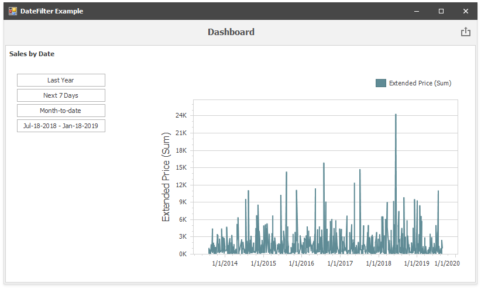

<!-- default file list -->
*Files to look at*:

* [Form1.cs](./CS/DateFilterDashboardItemSample/Form1.cs) (VB: [Form1.vb](./VB/DateFilterDashboardItemSample/Form1.vb))
<!-- default file list end -->

# How to Create a Dashboard with DateFilterDashboardItem in Code

This example creates a dashboard in code and displays it in the Dashboard Viewer control. The dashboard contains a DateFilter and a Chart items placed in a Group item. The dashboard is bound to an Excel data source. The layout is constructed in code.

API in this example:

* [DateFilterDashboardItem](https://docs.devexpress.com/Dashboard/DevExpress.DashboardCommon.DateFilterDashboardItem) class
* [ChartDashboardItem](https://docs.devexpress.com/Dashboard/DevExpress.DashboardCommon.ChartDashboardItem) class
* [DashboardItemGroup](https://docs.devexpress.com/Dashboard/DevExpress.DashboardCommon.DashboardItemGroup) class
* [DashboardExcelDataSource](https://docs.devexpress.com/Dashboard/DevExpress.DashboardCommon.DashboardExcelDataSource) class
* [DashboardLayoutItem](https://docs.devexpress.com/Dashboard/DevExpress.DashboardCommon.DashboardLayoutItem) class
* [DashboardLayoutGroup](https://docs.devexpress.com/Dashboard/DevExpress.DashboardCommon.DashboardLayoutGroup) class
* [Dashboard.LayoutRoot](https://docs.devexpress.com/Dashboard/DevExpress.DashboardCommon.Dashboard.LayoutRoot) property
* [DashboardViewer](https://docs.devexpress.com/Dashboard/DevExpress.DashboardWin.DashboardViewer) class

## Documentation

- [Binding to Data](https://docs.devexpress.com/Dashboard/116771) 
- [Dashboard Items](https://docs.devexpress.com/Dashboard/116521)
- [Dashboard Layout](https://docs.devexpress.com/Dashboard/15617)
- [WinForms Viewer](https://docs.devexpress.com/Dashboard/117122)

## More Examples 

* [How to add window calculations for numeric measures in code](https://github.com/DevExpress-Examples/winforms-dashboard-window-calculation-example) 
* [How to bind a Treemap dashboard item to data in code](https://github.com/DevExpress-Examples/how-to-bind-a-treemap-dashboard-item-to-data-in-code-t429531)
* [How to bind a Bound Image dashboard item to data in code](https://github.com/DevExpress-Examples/how-to-bind-a-bound-image-dashboard-item-to-data-in-code-t382366)
* [How to bind a Scatter Chart dashboard item to data in code](https://github.com/DevExpress-Examples/how-to-bind-a-scatter-chart-dashboard-item-to-data-in-code-t306222)
* [How to bind a Grid dashboard item to data in code](https://github.com/DevExpress-Examples/how-to-create-a-new-dashboard-add-a-grid-dashboard-item-to-it-and-bind-it-to-data-in-code-e4768)
* [How to bind a Bubble Map dashboard item to data in code](https://github.com/DevExpress-Examples/how-to-bind-a-bubble-map-dashboard-item-to-data-and-customize-its-palette-t119682)
* [How to bind a Chart dashboard item to data in code](https://github.com/DevExpress-Examples/how-to-bind-a-chart-dashboard-item-to-data-in-code-e4767)
* [How to Bind a Card Dashboard Item to Data in Code](https://github.com/DevExpress-Examples/how-to-bind-a-card-dashboard-item-to-data-in-code) 
* [How to bind a Gauge dashboard item to data in code](https://github.com/DevExpress-Examples/how-to-bind-a-gauge-dashboard-item-to-data-in-code-e4771)
* [How to bind a Pie dashboard item to data in code](https://github.com/DevExpress-Examples/how-to-bind-a-pie-dashboard-item-to-data-in-code-e4769)
* [How to bind a Pivot dashboard item to data in code](https://github.com/DevExpress-Examples/how-to-bind-a-pivot-dashboard-item-to-data-in-code-e4772)
* [How to bind a Choropleth Map dashboard item to data in code](https://github.com/DevExpress-Examples/how-to-bind-a-choropleth-map-dashboard-item-to-data-in-code-e5010)
* [How to bind a Range Filter dashboard item to data in code](https://github.com/DevExpress-Examples/how-to-bind-a-range-filter-dashboard-item-to-data-in-code-e4773)
